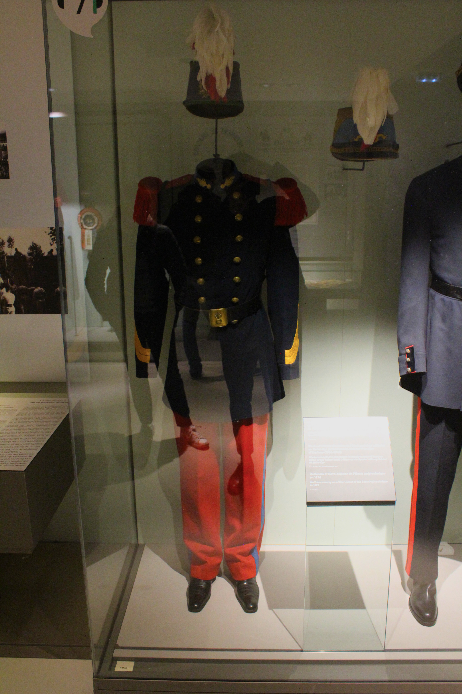

# Galerie d'Images

Bienvenue dans ce projet ! Ce fichier présente une galerie des images disponibles dans le dossier `traiter`.

Voici une courte introduction à Saint Barbes pour les artilleurs et les Invalides :

## Saint Barbes et les Invalides

**Saint Barbe** est la sainte patronne des artilleurs, des mineurs et des pompiers. Célébrée chaque année le 4 décembre, elle incarne la protection face aux dangers liés aux explosions et aux feux.  

Aux **Invalides**, ce jour est marqué par des cérémonies et des événements qui rendent hommage aux traditions militaires et au rôle crucial des artilleurs dans l'histoire. Ce cadre majestueux, riche en histoire, renforce la solennité et l'importance de cette célébration.  

## Aperçu des Images

### Images en Grille

  <table>
    <tr>
      <td align="center"> Image 1</td>
      <td align="center"> Image 2</td>
      <td align="center"> Image 3</td>
    </tr>
    <tr>
      <td align="center"> Image 4</td>
      <td align="center"> Image 5</td>
      <td align="center"> Image 6</td>
    </tr>
    <tr>
      <td align="center"> Image 7</td>
      <td align="center"> Image 8</td>
      <td align="center"> Image 9</td>
    </tr>
    <tr>
      <td align="center"> Image 10</td>
      <td align="center"> Image 11</td>
      <td align="center"> Image 12</td>
    </tr>
    <tr>
      <td align="center"> Image 13</td>
      <td align="center"> Image 14</td>
      <td align="center"> Image 15</td>
    </tr>
    <tr>
      <td align="center"> Image 16</td>
      <td align="center"> Image 17</td>
      <td align="center"> Image 18</td>
    </tr>
    <tr>
      <td align="center"> Image 19</td>
      <td align="center"> Image 20</td>
      <td align="center"> Image 21</td>
    </tr>
    <tr>
      <td align="center"> Image 22</td>
      <td align="center"> Image 23</td>
      <td align="center"> Image 24</td>
    </tr>
    <tr>
      <td align="center"> Image 25</td>
      <td align="center"> Image 26</td>
      <td align="center"> Image 27</td>
    </tr>
    <tr>
      <td align="center"> Image 28</td>
      <td align="center"> Image 29</td>
      <td align="center"> Image 30</td>
    </tr>
    <tr>
      <td align="center"> Image 31</td>
      <td align="center"> Image 32</td>
      <td align="center"> Image 33</td>
    </tr>
    <tr>
      <td align="center"> Image 34</td>
      <td align="center"> Image 35</td>
      <td align="center"> Image 36</td>
    </tr>
    <tr>
      <td align="center"> Image 37</td>
      <td align="center"> Image 38</td>
      <td align="center"> Image 39</td>
    </tr>
    <tr>
      <td align="center"> Image 40</td>
      <td align="center"> Image 41</td>
      <td align="center"> Image 42</td>
    </tr>
    <tr>
      <td align="center"> Image 43</td>
      <td align="center"> Image 44</td>
      <td align="center"> Image 45</td>
    </tr>
    <tr>
      <td align="center"> Image 46</td>
      <td align="center"> Image 47</td>
      <td align="center"> Image 48</td>
    </tr>
    <tr>
      <td align="center"> Image 49</td>
      <td align="center"> Image 50</td>
      <td align="center"> Image 51</td>
    </tr>
    <tr>
      <td align="center"> Image 52</td>
      <td align="center"> Image 53</td>
      <td align="center"> Image 54</td>
    </tr>
  </table>

